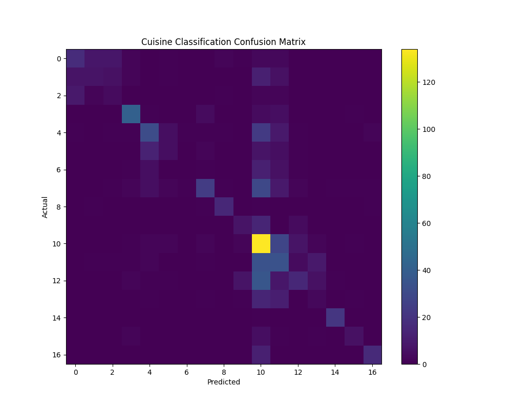

# 🍽️ Cuisine Classification Using Machine Learning

A machine learning classification project that predicts restaurant cuisine categories using restaurant-related information. The project applies data preprocessing, feature encoding, TF-IDF text feature extraction, and Random Forest classification to classify cuisine types.

## 📌 Project Overview

Cuisine classification can help organize restaurants into meaningful cuisine categories based on available restaurant information.

In this project, restaurant data is processed and machine learning techniques are applied to classify restaurants into different cuisine categories.

The project includes:

* Data preprocessing
* Missing-value inspection
* Categorical feature encoding
* Feature selection
* Train-test splitting
* Random Forest classification
* TF-IDF text feature extraction
* Accuracy, precision, and recall evaluation
* Confusion matrix visualization

## 🎯 Problem Statement

Build a machine learning classification model that can predict the cuisine category of a restaurant using available restaurant-related features.

## 📊 Dataset

The project uses a restaurant dataset containing information such as:

* City
* Average Cost for Two
* Price Range
* Aggregate Rating
* Votes
* Table Booking Availability
* Online Delivery Availability
* Restaurant Name
* Cuisine Category

The dataset is stored in:

```text
Dataset .csv
```

## 🛠️ Technologies Used

* Python
* Pandas
* NumPy
* Scikit-learn
* Matplotlib
* TF-IDF
* Random Forest
* Label Encoding

## 🧠 Machine Learning Approach

### 1. Data Loading

The restaurant dataset is loaded using Pandas.

### 2. Data Inspection

The project checks the dataset structure and missing values before model training.

### 3. Feature Selection

The following restaurant features are used during the initial classification process:

* City
* Average Cost for Two
* Price Range
* Aggregate Rating
* Votes
* Has Table Booking
* Has Online Delivery

The target variable is:

```text
Cuisines
```

### 4. Data Encoding

Categorical values are converted into numerical representations using `LabelEncoder`.

### 5. Train-Test Split

The dataset is divided into training and testing sets using an 80:20 split.

```text
Training Data → 80%
Testing Data  → 20%
```

### 6. Random Forest Classification

A Random Forest Classifier is used for cuisine classification.

The initial model uses:

```text
n_estimators = 50
max_depth = 10
random_state = 42
```

### 7. TF-IDF Feature Extraction

Text information is also combined and converted into numerical features using TF-IDF.

The project uses restaurant name and city information to create text-based features.

### 8. Model Evaluation

The model is evaluated using:

* Accuracy
* Precision
* Recall
* Classification Report
* Confusion Matrix

## 📈 Results

The project evaluates cuisine classification performance using the test dataset.

### Final Classification Result

* **Number of cuisine categories:** 17
* **Accuracy:** approximately **44.03%**

The confusion matrix generated by the project is available here:



> Note: The classification problem contains multiple cuisine categories, so performance can vary across individual classes. The confusion matrix provides a visual comparison between actual and predicted classes.

## 📁 Project Structure

```text
Cuisine-Classification/
│
├── .vscode/
│
├── Dataset .csv
│
├── cuisine_classification.py
│
├── confusion_matrix.png
│
├── requirements.txt
│
└── README.md
```

## ▶️ How to Run the Project

### 1. Clone the repository

```bash
git clone https://github.com/Padmavati2611/Cuisine-Classification.git
```

### 2. Open the project folder

```bash
cd Cuisine-Classification
```

### 3. Install the required libraries

```bash
pip install -r requirements.txt
```

### 4. Run the Python program

```bash
python cuisine_classification.py
```

The program loads the dataset, preprocesses the data, trains the Random Forest models, evaluates the predictions, and generates the confusion matrix.

## 📌 Key Learning Outcomes

Through this project, I practiced:

* Data preprocessing
* Exploratory data handling
* Categorical encoding
* Text feature extraction
* TF-IDF
* Random Forest classification
* Train-test splitting
* Model evaluation
* Confusion matrix visualization
* Python-based machine learning workflow

## 🚀 Future Improvements

* Improve classification performance using hyperparameter tuning
* Handle class imbalance more effectively
* Compare multiple classification algorithms
* Improve text feature engine
